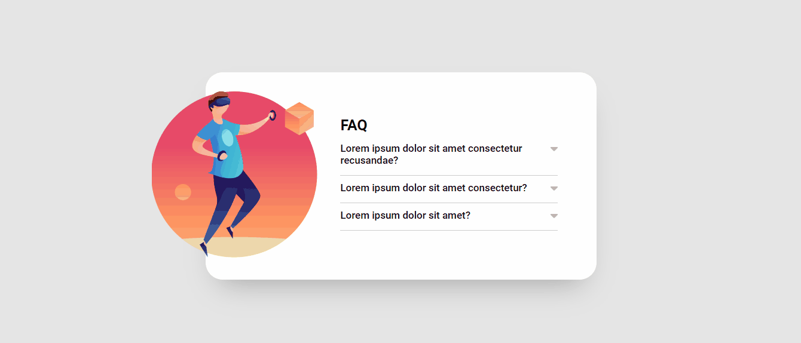

## FAQ - Frequently Asked Questions

### Tecnologias e Processo de Desenvolvimento

O projeto foi estruturado e estilizado com HTML e CSS. A interação da FAQ foi criada com JavaScript.

O maior desafio nesse projeto foi na criação do evento em JavaScript. Antes da refatoração o código cumpria o que se propunha, mas a especificidade e possibilidade de uso de múltiplas classes no CSS, juntamente com a manipulação assertiva do DOM foram grandes aliados para um código JavaScript limpo e funcional.

### Site
O resultado você pode conferir [clicando aqui](https://als-samara.github.io/faq-acordeon/).

### Preview
